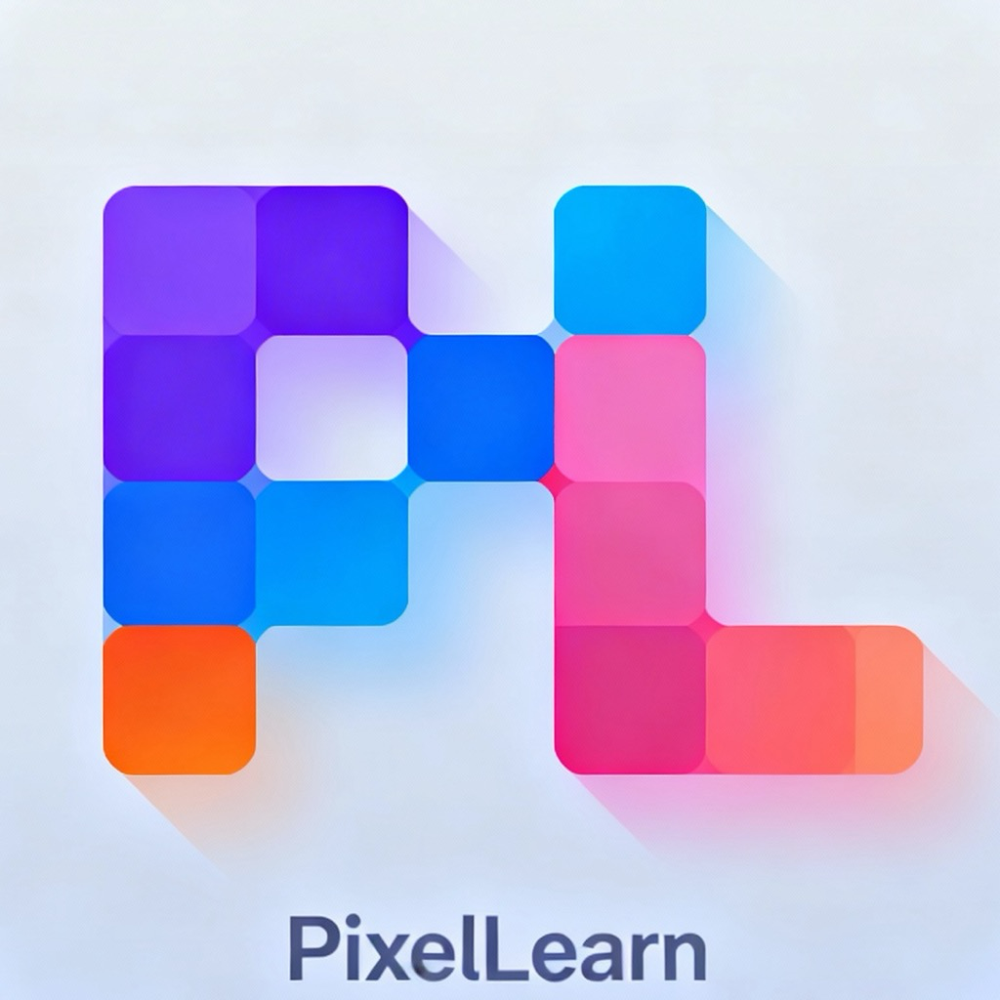
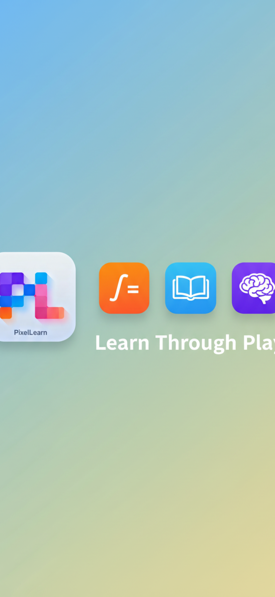

# PixelLearn

<p align="center">
  
</p>

<p align="center">
  <strong>Learn Through Play</strong><br>
  Adaptive learning that grows with your child
</p>

<p align="center">
  <a href="#">
    
  </a>
  <a href="#">
    
  </a>
  <a href="#">
    
  </a>
</p>

---

<p align="center">
  
  &nbsp;&nbsp;&nbsp;
  
  &nbsp;&nbsp;&nbsp;
  
</p>

---

## Features

### Math Quizzes
Addition, subtraction, multiplication, and division with **65 adaptive difficulty levels** that grow with your child.

### Grammar Practice
Spelling, vocabulary, and sentence structure exercises that adapt to your child's reading level.

### Memory Games
Match emoji pairs with **7 fun themes** including fruits, animals, vehicles, sports, and more.

### Multiplayer Mode
Play with **2-4 players**! Take turns answering questions and compete for the highest score. Perfect for family game night.

### Adaptive Learning
Difficulty automatically adjusts based on performance:
- Get 3 right in a row → Level up
- Get 2 wrong → Level down

### Multiple Profiles
Create profiles for each child. Track correct answers, wins, and progress separately.

---

## Tech Stack

- **SwiftUI** - Modern declarative UI framework
- **Swift** - 100% Swift codebase
- **Core Data** - Local persistence for profiles and progress
- **No backend required** - Works completely offline

---

## Privacy

- 100% Free, no ads
- No in-app purchases or subscriptions
- No account required
- Works offline
- No data collection

---

## Project Structure

```
PixelLearn/
├── App/                    # App entry point
├── Core/                   # Shared utilities and models
├── Features/
│   ├── Adventure/          # Quiz and memory game views
│   ├── Home/               # Main home screen
│   ├── Multiplayer/        # Multiplayer game modes
│   ├── Onboarding/         # First-time user experience
│   └── Profile/            # User profile settings
├── Resources/              # Assets and app icon
└── QuestionGenerator/      # Quiz question generation
```

---

## Requirements

- iOS 16.0+
- Xcode 15.0+

---

## Building

1. Clone the repository
2. Open `PixelLearn.xcodeproj` in Xcode
3. Build and run on simulator or device

---

## Links

- [Privacy Policy](docs/privacy.html)
- [Terms of Use](docs/terms.html)
- [Support](docs/support.html)

---

## License

MIT License - see [LICENSE](LICENSE) for details.
